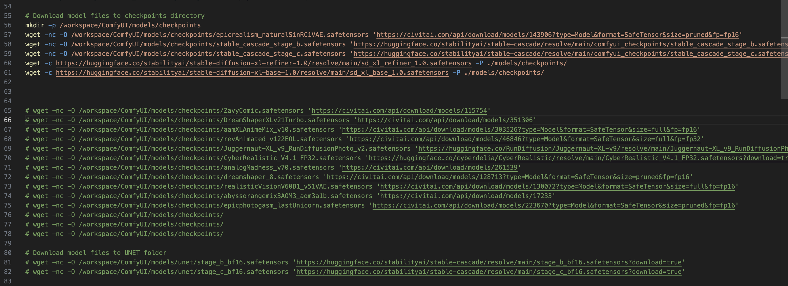

# ComfyUI_EZ_Setup

AKA THE ONE CLICK WONDER 
AKA THE NODE DEMON 
AKA THE NODE WHISPERER 

FASTEST BOOBA DEPLOYER IN NORTH AMERICA 
UNBELIEVABLE SWIFTNESS AND CURATION OF NODES 

HUGE INSTALLATION INSTRUCTIONS RIGHT BELOW THE HUGE BOOBNODES 

 
EAT SLEEP NODE EAT SLEEP NODE EAT SLEEP NODE EAT SLEEP NODE EAT SLEEP NODE EAT SLEEP NODE EAT SLEEP NODE EAT SLEEP NODE EAT SLEEP NODE EAT SLEEP NODE EAT SLEEP NODE


UWU ITS THE INSTALLATION GUIDE UWU

---- DEFAULT INSTALLATION ROUGHLY 80GB ------

STEP 1: <pre>
```bash
git clone https://github.com/GitWaifus/ComfyUI_EZ_Setup.git
```
</pre>

STEP 2: <pre>
```bash
cd ComfyUI_EZ_Setup
chmod +x comfy.sh
./comfy.sh
```
</pre>

STEP 3: ONCE SETUP.SH COMPLETES (30-60 minutes) <pre>
```bash
cd /workspace/ComfyUI
source /workspace/ComfyUI/venv/bin/activate
python3 main.py --listen 0.0.0.0 --port 3000
```
</pre>
 
----- DEFAULT INSTALLATION ONLY INCLUDES SDXL BASE, STABILITY AI CASCADE, AND EPICREALISM ---

There is tons of custom nodes, loras, vae, control net addons and etc. included by default

SETUP.SH CONTAINS A LOT OF JUICY CHECKPOINTS THAT ARE NOT INCLUDED IN DEFAULT INSTALLATION



CONSIDER REMOVING THE # ON EACH CHECKPOINT YOU WOULD ALSO LIKE TO INCLUDE BY DEFAULT 

YOU CAN RUN THE COMMANDS DIRECTLY IN TERMINAL FOR EVERYTHING COMMENTED OUT YOU WOULD LIKE TO INCLUDE 

